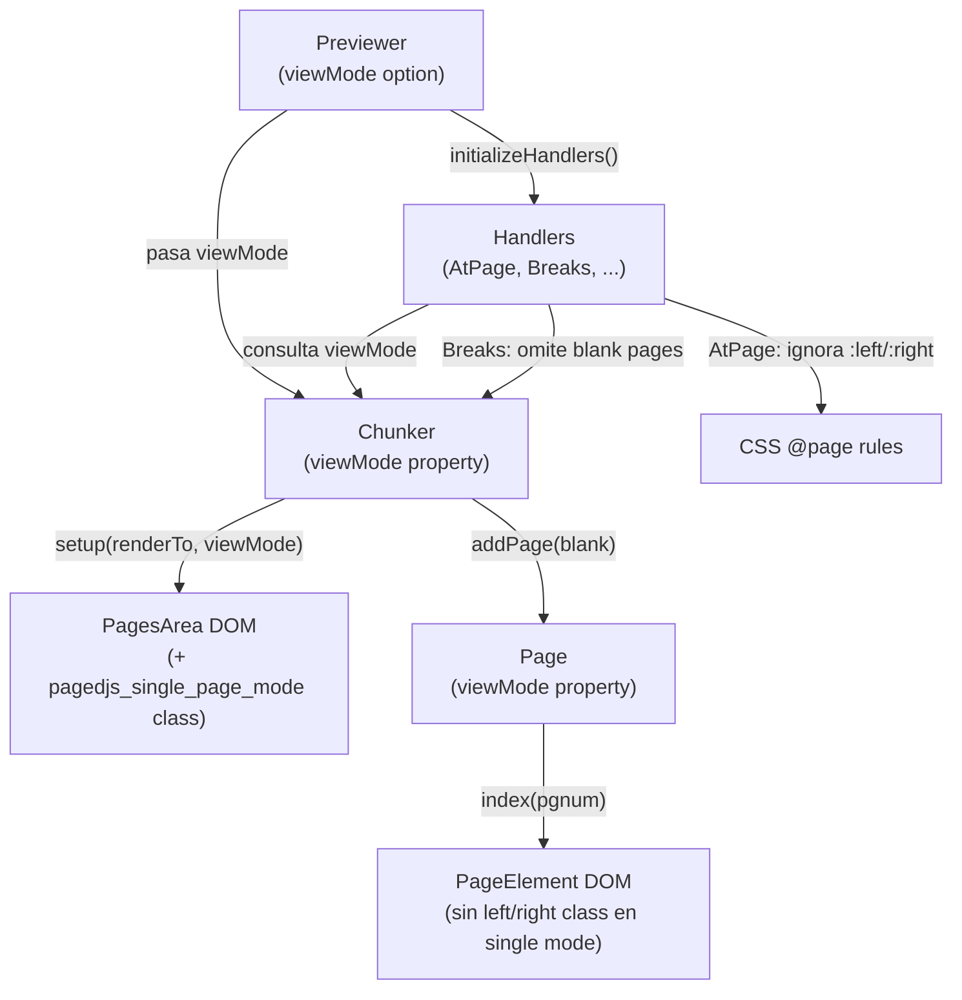

# Design Document: single-page-centered-view

## Overview

Esta feature añade un **modo de visualización de página única centrada** (`Single_Page_Mode`) a paper-view. En este modo, cada página se renderiza de forma independiente y centrada horizontalmente en el viewport, sin distinción izquierda/derecha ni layout de libro (spread). El modo se activa mediante la opción `viewMode: "single"` en el constructor del `Previewer` y coexiste con el comportamiento existente (`viewMode: "spread"`, que permanece como valor por defecto).

Los cambios son mínimamente invasivos: se introduce un flag de modo que fluye desde el `Previewer` hacia el `Chunker` y los módulos handler (`AtPage`, `Breaks`), condicionando tres comportamientos específicos:

1. Supresión de clases CSS `pagedjs_left_page` / `pagedjs_right_page` en las páginas.
2. Supresión de páginas en blanco generadas por saltos `break-before: left/right/verso/recto`.
3. Supresión del procesamiento de reglas CSS `@page :left` y `@page :right`.

Adicionalmente, se añade la clase `pagedjs_single_page_mode` al `PagesArea` para habilitar el centrado CSS.

---

## Architecture

El diseño sigue el patrón existente de la librería: el `Previewer` es el punto de entrada público, el `Chunker` gestiona el layout de páginas, y los módulos handler se suscriben a hooks del ciclo de vida para modificar el comportamiento.



### Flujo del flag `viewMode`

```
new Previewer({ viewMode: "single" })
  └─ this._viewMode = "single"
  └─ this.chunker = new Chunker()
  └─ this.chunker.viewMode = "single"   ← asignado en preview()
  └─ initializeHandlers(chunker, polisher, this)
       └─ new AtPage(chunker, ...)       ← accede a chunker.viewMode
       └─ new Breaks(chunker, ...)       ← accede a chunker.viewMode
```

---

## Components and Interfaces

### 1. `Previewer` (`src/polyfill/previewer.js`)

**Cambios:**
- El constructor acepta `options = {}` con la propiedad `viewMode`.
- Valida `viewMode`: si no es `"single"` ni `"spread"`, emite `console.warn` y usa `"spread"`.
- Almacena el modo en `this._viewMode` (privado) y lo expone como getter de solo lectura `viewMode`.
- Propaga `viewMode` al `Chunker` antes de llamar a `flow()`.
- Incluye `viewMode` en el objeto `flow` retornado por `preview()`.
- Emite evento `viewModeChanged` si el modo es modificado post-construcción mediante un setter.

```javascript
// API pública
new Previewer({ viewMode: "single" | "spread" })
previewer.viewMode  // getter de solo lectura → "single" | "spread"
previewer.on("viewModeChanged", (newMode) => { ... })
```

### 2. `Chunker` (`src/chunker/chunker.js`)

**Cambios:**
- Nueva propiedad `viewMode` (string, default `"spread"`).
- `setup(renderTo)`: si `viewMode === "single"`, añade la clase `pagedjs_single_page_mode` al `pagesArea`.
- `addPage(blank)`: pasa `viewMode` al constructor de `Page`.
- `handleBreaks(node)`: si `viewMode === "single"`, retorna inmediatamente sin insertar páginas en blanco.

```javascript
chunker.viewMode = "single" | "spread"
```

### 3. `Page` (`src/chunker/page.js`)

**Cambios:**
- El constructor acepta un quinto parámetro `viewMode`.
- Almacena `this.viewMode`.
- `index(pgnum)`: si `viewMode !== "single"`, aplica la lógica existente de clases `pagedjs_left_page` / `pagedjs_right_page` (actualmente comentada en el código fuente — se descomenta y condiciona).

> **Nota:** La lógica de asignación de clases left/right está actualmente comentada en `page.js`. Esta feature la descomenta y la envuelve en una condición `if (this.viewMode !== "single")`.

```javascript
new Page(pagesArea, pageTemplate, blank, hooks, viewMode)
page.viewMode  // "single" | "spread"
```

### 4. `AtPage` (`src/modules/paged-media/atpage.js`)

**Cambios:**
- `addPageClasses(pages, ast, sheet)`: si `chunker.viewMode === "single"`, omite el procesamiento de las entradas `":left"` y `":right"` del mapa `pages`.

```javascript
// En addPageClasses():
if (this.chunker.viewMode !== "single") {
    // procesar :left y :right
}
```

### 5. `Breaks` (`src/modules/paged-media/breaks.js`)

**Cambios:**
- No requiere cambios directos. La supresión de páginas en blanco se gestiona en `Chunker.handleBreaks()` que es donde se toma la decisión de insertar blank pages. El módulo `Breaks` solo añade atributos `data-*` al DOM, lo cual es inofensivo en single mode.

### 6. CSS de centrado (inyectado en `base.js` o como estilo inline)

Se añade la siguiente regla CSS al estilo base de la librería:

```css
.pagedjs_pages.pagedjs_single_page_mode {
    display: flex;
    flex-direction: column;
    align-items: center;
}
```

Esta regla se añade al string exportado por `src/polisher/base.js`.

---

## Data Models

### `ViewMode` type

```typescript
type ViewMode = "single" | "spread";
```

### `PreviewerOptions`

```typescript
interface PreviewerOptions {
    viewMode?: ViewMode;  // default: "spread"
}
```

### `Previewer` state additions

```typescript
class Previewer {
    _viewMode: ViewMode;          // almacenamiento interno
    get viewMode(): ViewMode;     // getter público de solo lectura
    set viewMode(v: ViewMode);    // setter que emite viewModeChanged
}
```

### `Chunker` state additions

```typescript
class Chunker {
    viewMode: ViewMode;  // default: "spread"
}
```

### `Page` constructor signature

```typescript
class Page {
    constructor(
        pagesArea: HTMLElement,
        pageTemplate: HTMLTemplateElement,
        blank: boolean,
        hooks: object,
        viewMode: ViewMode  // nuevo parámetro, default: "spread"
    )
    viewMode: ViewMode;
}
```

### `flow` return object additions

```typescript
interface FlowResult {
    // ... propiedades existentes ...
    viewMode: ViewMode;  // nuevo campo
}
```

---

## Correctness Properties

*A property is a characteristic or behavior that should hold true across all valid executions of a system — essentially, a formal statement about what the system should do. Properties serve as the bridge between human-readable specifications and machine-verifiable correctness guarantees.*

### Property 1: Fallback para viewMode inválido

*Para cualquier* string que no sea `"single"` ni `"spread"`, instanciar `Previewer` con ese valor como `viewMode` SHALL resultar en `previewer.viewMode === "spread"`.

**Validates: Requirements 1.5**

---

### Property 2: Ausencia de clases left/right en Single_Page_Mode

*Para cualquier* índice de página (par, impar, primero, último), cuando el `Chunker` opera en `Single_Page_Mode`, el `PageElement` correspondiente NO SHALL contener las clases `pagedjs_left_page` ni `pagedjs_right_page`.

**Validates: Requirements 2.1**

---

### Property 3: Supresión de blank pages en Single_Page_Mode

*Para cualquier* nodo con atributo `data-break-before` con valor `"left"`, `"right"`, `"verso"` o `"recto"`, cuando el `Chunker` opera en `Single_Page_Mode`, `handleBreaks` SHALL retornar sin insertar ninguna página en blanco.

**Validates: Requirements 2.2**

---

### Property 4: Asignación correcta de clases left/right en Spread_Mode

*Para cualquier* índice de página `n`, cuando el `Chunker` opera en `Spread_Mode`, el `PageElement` en posición par SHALL tener la clase `pagedjs_left_page` y el de posición impar SHALL tener `pagedjs_right_page`.

**Validates: Requirements 2.3, 5.3**

---

### Property 5: Supresión de @page :left/:right en Single_Page_Mode

*Para cualquier* hoja CSS que contenga reglas `@page :left` y/o `@page :right`, cuando `AtPage` procesa esa hoja en `Single_Page_Mode`, las entradas `":left"` y `":right"` SHALL estar ausentes del mapa `pages` resultante.

**Validates: Requirements 3.1, 3.4**

---

### Property 6: Procesamiento de @page :left/:right en Spread_Mode

*Para cualquier* hoja CSS que contenga reglas `@page :left` y/o `@page :right`, cuando `AtPage` procesa esa hoja en `Spread_Mode`, las entradas `":left"` y `":right"` SHALL estar presentes en el mapa `pages` resultante.

**Validates: Requirements 3.3, 5.4**

---

## Error Handling

| Situación | Comportamiento |
|---|---|
| `viewMode` inválido en constructor | `console.warn` + fallback a `"spread"` |
| `viewMode` no proporcionado | Silencioso, usa `"spread"` |
| `AtPage` ignora `:left`/`:right` en single mode | Silencioso, sin errores ni warnings |
| `handleBreaks` en single mode con break left/right | Retorno temprano silencioso |

No se lanzan excepciones en ningún caso. El principio es degradación silenciosa con fallback seguro al comportamiento existente.

---

## Testing Strategy

### Enfoque dual

Se usan **tests unitarios** (Jest + jsdom) para comportamientos específicos y **property-based tests** para propiedades universales. Los tests de integración con puppeteer (specs/) cubren el renderizado visual end-to-end.

### Librería PBT

Se usa **[fast-check](https://github.com/dubzzz/fast-check)** para property-based testing, compatible con Jest y el entorno jsdom del proyecto.

```bash
npm install --save-dev fast-check
```

### Tests unitarios (tests/)

Ubicación: `tests/previewer/previewer.test.js`, `tests/chunker/chunker.test.js`, `tests/page/page.test.js`, `tests/atpage/atpage.test.js`

**Comportamientos específicos a cubrir:**
- Constructor de `Previewer` con `viewMode: "single"`, `"spread"`, y sin opciones.
- Getter `viewMode` retorna el valor correcto.
- Setter `viewMode` emite evento `viewModeChanged`.
- `Chunker.setup()` añade/omite clase `pagedjs_single_page_mode` según modo.
- `Page` expone propiedad `viewMode`.
- `AtPage` procesa `@page :first` y `@page :blank` en single mode.
- Objeto `flow` incluye `viewMode`.

### Property-based tests (tests/)

Cada property test ejecuta **mínimo 100 iteraciones**. Cada test referencia su propiedad de diseño con el tag:

`// Feature: single-page-centered-view, Property N: <texto>`

**Property 1** — Fallback para viewMode inválido:
```javascript
// Feature: single-page-centered-view, Property 1: Fallback para viewMode inválido
fc.assert(fc.property(
    fc.string().filter(s => s !== "single" && s !== "spread"),
    (invalidMode) => {
        const p = new Previewer({ viewMode: invalidMode });
        return p.viewMode === "spread";
    }
), { numRuns: 100 });
```

**Property 2** — Ausencia de clases left/right en Single_Page_Mode:
```javascript
// Feature: single-page-centered-view, Property 2: Ausencia de clases left/right en Single_Page_Mode
fc.assert(fc.property(
    fc.integer({ min: 0, max: 999 }),
    (pageIndex) => {
        const chunker = new Chunker();
        chunker.viewMode = "single";
        chunker.setup();
        const page = chunker.addPage(false);
        page.index(pageIndex);
        return !page.element.classList.contains("pagedjs_left_page") &&
               !page.element.classList.contains("pagedjs_right_page");
    }
), { numRuns: 100 });
```

**Property 3** — Supresión de blank pages en Single_Page_Mode:
```javascript
// Feature: single-page-centered-view, Property 3: Supresión de blank pages en Single_Page_Mode
fc.assert(fc.property(
    fc.constantFrom("left", "right", "verso", "recto"),
    async (breakValue) => {
        const chunker = new Chunker();
        chunker.viewMode = "single";
        chunker.setup();
        const initialCount = chunker.pages.length;
        const node = document.createElement("div");
        node.dataset.breakBefore = breakValue;
        await chunker.handleBreaks(node);
        return chunker.pages.length === initialCount;
    }
), { numRuns: 100 });
```

**Property 4** — Asignación correcta de clases left/right en Spread_Mode:
```javascript
// Feature: single-page-centered-view, Property 4: Asignación correcta de clases left/right en Spread_Mode
fc.assert(fc.property(
    fc.integer({ min: 0, max: 999 }),
    (pageIndex) => {
        const chunker = new Chunker();
        chunker.viewMode = "spread";
        chunker.setup();
        const page = chunker.addPage(false);
        page.index(pageIndex);
        const isEven = pageIndex % 2 === 0;
        return isEven
            ? page.element.classList.contains("pagedjs_right_page")
            : page.element.classList.contains("pagedjs_left_page");
    }
), { numRuns: 100 });
```

**Property 5** — Supresión de @page :left/:right en Single_Page_Mode:
```javascript
// Feature: single-page-centered-view, Property 5: Supresión de @page :left/:right en Single_Page_Mode
fc.assert(fc.property(
    fc.constantFrom(":left", ":right", ":left and :right"),
    (ruleType) => {
        const chunker = new Chunker();
        chunker.viewMode = "single";
        const atPage = new AtPage(chunker, null, null);
        // Simular procesamiento de reglas @page :left/:right
        atPage.pages[":left"] = atPage.pageModel(":left");
        atPage.pages[":right"] = atPage.pageModel(":right");
        // addPageClasses debe ignorarlas en single mode
        const mockAst = { children: { appendData: () => {} } };
        const mockSheet = { insertRule: () => {} };
        atPage.addPageClasses(atPage.pages, mockAst, mockSheet);
        return !atPage.pages[":left"]?.added && !atPage.pages[":right"]?.added;
    }
), { numRuns: 100 });
```

**Property 6** — Procesamiento de @page :left/:right en Spread_Mode:
```javascript
// Feature: single-page-centered-view, Property 6: Procesamiento de @page :left/:right en Spread_Mode
fc.assert(fc.property(
    fc.constant(null), // deterministic
    (_) => {
        const chunker = new Chunker();
        chunker.viewMode = "spread";
        const atPage = new AtPage(chunker, null, null);
        atPage.pages[":left"] = atPage.pageModel(":left");
        atPage.pages[":right"] = atPage.pageModel(":right");
        const mockAst = { children: { appendData: () => {} } };
        const mockSheet = { insertRule: () => {} };
        atPage.addPageClasses(atPage.pages, mockAst, mockSheet);
        return atPage.pages[":left"]?.added === true && atPage.pages[":right"]?.added === true;
    }
), { numRuns: 100 });
```

### Tests de integración (specs/)

Se añade una spec `specs/single-page-centered-view/` con un HTML de prueba que verifica visualmente:
- Que las páginas están centradas en single mode.
- Que no hay clases left/right en los page elements.
- Que el número de páginas es el esperado (sin blank pages extra).

### Notas sobre compatibilidad

Los tests existentes en `specs/` no deben verse afectados ya que el modo por defecto sigue siendo `"spread"`. Se recomienda ejecutar la suite completa de specs tras la implementación para confirmar la ausencia de regresiones.
